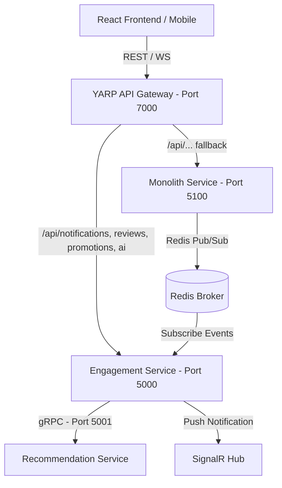

# FlexFit Microservices — Engagement & Recommendation Services

Hệ thống microservices mở rộng của FlexFit bao gồm các dịch vụ tương tác (Engagement), gợi ý luyện tập bằng AI/gRPC (Recommendation) và API Gateway (YARP).

## Kiến Trúc Hệ Thống



### Các Dịch Vụ Chính

1. **YARP API Gateway (`FlexFit.ApiGateway`)**: Chạy tại cổng `7000`. Định tuyến thông minh các API và kết nối SignalR WebSocket.
2. **Engagement Service (`FlexFit.Engagement.API`)**: Chạy tại cổng `5000`. Quản lý thông báo (Notifications), đánh giá (Reviews), khuyến mãi (Promotions), lịch sử tập luyện (Workout History) và AI Assistant (Gemini).
3. **Recommendation Service (`FlexFit.Recommendation.Grpc`)**: Chạy tại cổng `5001`. Cung cấp API gRPC để gợi ý bài tập và lớp học cho Engagement Service.
4. **Redis Message Broker**: Dùng cho giao tiếp bất đồng bộ Pub/Sub từ Monolith sang Engagement Service (tự động tạo thông báo khi có sự kiện: đặt lịch, thanh toán, điểm danh...).

---

## Hướng Dẫn Chạy Hệ Thống

### Cách 1: Chạy bằng Docker Compose (Khuyên dùng)

Yêu cầu đã cài đặt Docker Desktop. Đứng tại thư mục gốc chạy lệnh:

```bash
docker-compose up --build
```

Dịch vụ sẽ tự động dựng và khởi chạy:
- Gateway: `http://localhost:7000`
- Engagement Service: `http://localhost:5000` (Swagger: `http://localhost:5000/swagger`)
- Recommendation Service (gRPC): `http://localhost:5001`
- Redis: `localhost:6379`

### Cách 2: Chạy Thủ Công (Chế độ Development)

1. **Khởi chạy Redis**:
   ```bash
   docker run -d --name flexfit-redis -p 6379:6379 redis:7-alpine
   ```

2. **Chạy Recommendation gRPC Service**:
   ```bash
   dotnet run --project src/Services/Recommendation/FlexFit.Recommendation.Grpc/FlexFit.Recommendation.Grpc.csproj --urls http://localhost:5001
   ```

3. **Chạy Engagement API**:
   ```bash
   # Cấu hình API Key Gemini trong appsettings.json nếu muốn dùng AI thực tế
   dotnet run --project src/Services/Engagement/FlexFit.Engagement.API/FlexFit.Engagement.API.csproj --urls http://localhost:5000
   ```

4. **Chạy API Gateway**:
   ```bash
   dotnet run --project src/Gateways/FlexFit.ApiGateway/FlexFit.ApiGateway.csproj --urls http://localhost:7000
   ```

---

## Cấu Hình Frontend

Thay đổi địa chỉ base API của React App sang địa chỉ Gateway:
- REST API: `http://localhost:7000/api`
- SignalR WebSocket: `http://localhost:7000/hubs/notifications`
